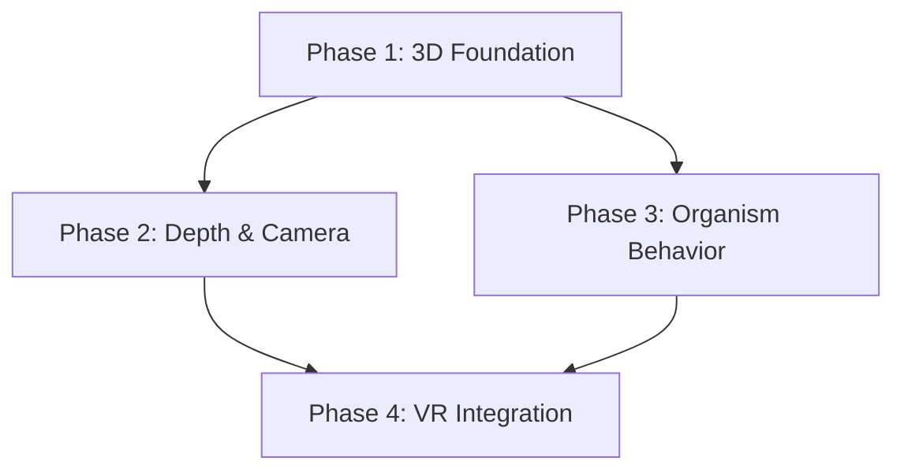

# Epic: 3D Visual Evolution

**Created:** 2026-01-26
**Status:** planning
**Complexity:** Complex
**Thinking Level:** ULTRATHINK

## Overview

Transform The Orrery from 2D SVG rendering to full 3D with VR support. This is a 3D-first approach with zero throwaway code — each phase deploys incrementally while building toward the final VR experience.

**Key Design Decisions (Validated):**
- Perspective camera with locked angle from Day 1 (depth visible immediately)
- Organic orbs with surface noise and breathing animations
- Three-layer cognitive load system (color → glow → pulse)
- Hybrid edges (thin line + flowing particles)
- Target platform: Pico 4 Ultra via WebXR

## Success Criteria

- [ ] 3D rendering replaces SVG with no regression in functionality
- [ ] Task nodes render as organic orbs with cognitive load visualization
- [ ] Dependency edges show flowing particles along bezier curves
- [ ] Camera supports orbit controls and depth navigation
- [ ] Cascade unlock animations work in 3D space
- [ ] Cosmic particles respond to task state
- [ ] VR mode enables via WebXR on Pico 4 Ultra
- [ ] Hand and controller tracking functional in VR
- [ ] 60fps on desktop, 72fps+ in VR
- [ ] Feature flag allows fallback to 2D during transition

---

## Dependency Graph

---

## Features

| Feature | Wave | Status | Plan | Depends On | Blocks |
|---------|------|--------|------|------------|--------|
| Phase 1: 3D Foundation | 1 | pending | - | - | Phase 2, Phase 3 |
| Phase 2: Depth & Camera | 2 | pending | - | Phase 1 | Phase 4 |
| Phase 3: Organism Behavior | 2 | pending | - | Phase 1 | Phase 4 |
| Phase 4: VR Integration | 3 | pending | - | Phase 2, Phase 3 | - |

---

## Execution Waves

### Wave 1
**Status:** pending
**Features:** Phase 1: 3D Foundation

- [ ] Phase 1 planned
- [ ] Wave 1 execution complete
- [ ] Integration verified

### Wave 2
**Status:** pending
**Features:** Phase 2: Depth & Camera, Phase 3: Organism Behavior

- [ ] Phase 2 planned
- [ ] Phase 3 planned
- [ ] Wave 2 execution complete (parallel)
- [ ] Integration verified

### Wave 3
**Status:** pending
**Features:** Phase 4: VR Integration

- [ ] Phase 4 planned
- [ ] Wave 3 execution complete
- [ ] Final integration verified

---

## Quality Gates

| Gate | Status | Passed At | Notes |
|------|--------|-----------|-------|
| Planning Complete | pending | - | |
| Wave 1 Complete | pending | - | |
| Wave 2 Complete | pending | - | |
| Wave 3 Complete | pending | - | |
| Epic Complete | pending | - | |

---

## Recovery

If context is lost, read this file and `state.json` to recover position.

**Current position:** Phase 1 (Architecture), creating epic workspace

**Last action:** Created epic workspace structure

**Next action:** Dispatch epic-feature-planner for Phase 1

---

## Log

| Date | Action | Result |
|------|--------|--------|
| 2026-01-26 | Epic created | Workspace initialized |
| 2026-01-26 | Plan committed | `docs/plans/2026-01-26-3d-visual-evolution.md` |
| | | |

---

## Source Plan Reference

Full design specification: [docs/plans/2026-01-26-3d-visual-evolution.md](../plans/2026-01-26-3d-visual-evolution.md)
